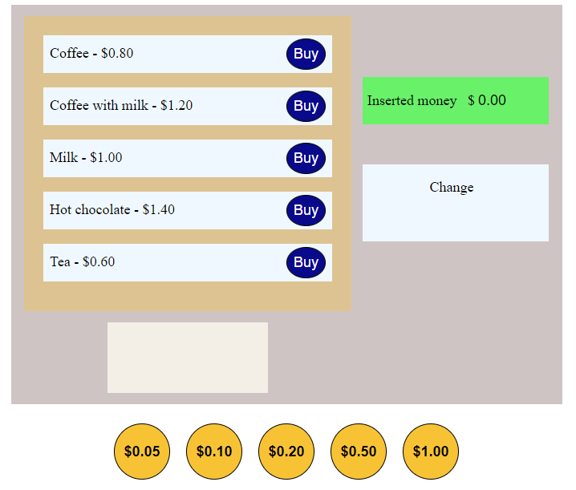

## Simple coffee automat made with HTML, CSS and JavaScript.



To get a local copy of the code, clone it using git:

```
git clone https://github.com/92gahov/Coffee-Automat
cd Coffee-Automat
```

```
start index.html
```

### `Final result` <a href="https://coffee-automat.surge.sh/" target="_blank">here</a>

